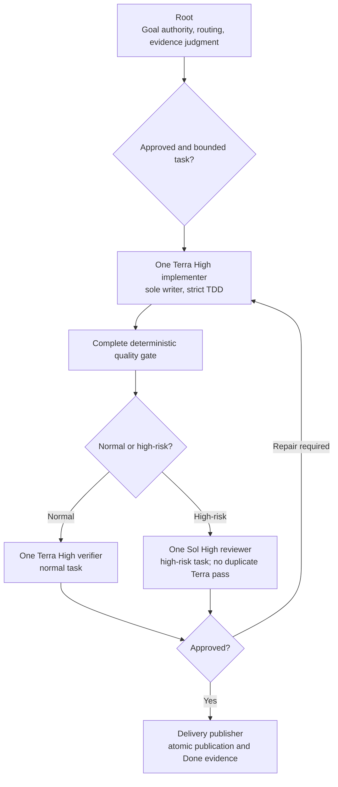
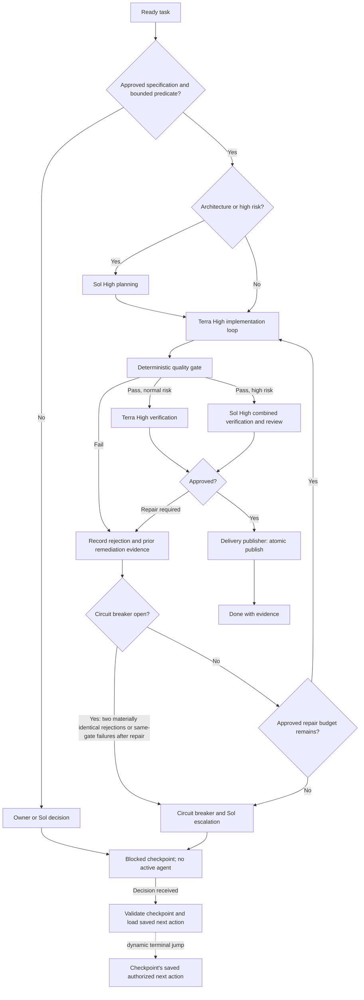

# Development workflow

This workflow is project-scoped. It supports the repository's architecture
freeze and does not change the locked research pipeline or market logic.
Apply the cross-cutting [engineering standards](engineering-standards.md) to
every implementation and review; this workflow defines the issue flow and
quality-gate process.

## Issue flow

Use Linear as the project Kanban when it is connected and authorized. One issue
represents one bounded outcome in the current locked-pipeline module. Move it
through `Backlog` → `Ready` → `In Progress` → `In Review` → `Done`; use
`Blocked` whenever an approval, specification, dependency, or quality gate
prevents progress.

An issue may enter `Ready` only with a linked approved specification containing
purpose, inputs, outputs, deterministic rules, edge cases, validation, and
acceptance criteria. Keep architecture decisions in the authoritative docs and
record durable, non-duplicative discussion outcomes under `docs/notes/` when
required by `AGENTS.md`.

## Conversation and delivery routing

General questions, opinions, brainstorming, and unpromoted references are
conversation work: answer them directly and concisely. They do not
automatically create a Linear issue, note, agent, test, review, PR, or gate.
Promote work into delivery only on explicit owner capture or a durable accepted
product, architecture, or workflow decision. A promotion remains one bounded
issue with one outcome; do not fragment it to manufacture activity.

Evidence is binding by risk tier: low-risk documentation or factual inventory
uses focused validation, normal review, and hosted CI after publication, without
an automatic local full suite or Sol review. Normal code uses strict TDD,
relevant tests, one deterministic full gate per sealed revision, independent
normal review, and PR/CI. High-risk work uses the same code evidence plus the
required Sol review and any compatibility proof.

Use this smoke-first escalation ladder before the risk-tier final evidence:
run seconds-long static, unit, or small representative deterministic smoke
checks before the affected suite; reproduce and repair any failure at the
smallest case, rather than repeating a full gate. Freeze the high-risk
acceptance matrix before a costly run. Run an expensive full suite, backtest,
or benchmark only after smoke and relevant checks are green and only once for a
sealed revision. Smoke-window performance or trading output is never
statistical, backtest, or strategy evidence. This ordering never waives the
mandatory final gate, independent review, or hosted CI.

Use one runner for one intended gate. Do not repeat a completed gate on an
unchanged revision, and do not create agents merely to relay status. A failed
process or runner launch that makes no content change does not consume a
content repair round or trigger the circuit breaker. Before delivery starts,
record a prospective wall-clock range and assumptions. At its upper bound,
record one concise overrun checkpoint with the observed delay, blocker, and next
action; estimates and Linear points are never labor hours.

## Knowledge-capture communication contract

For a substantive discussion, agents must not leave capture unresolved with
ambiguous phrasing such as “worth capturing.” Follow the capture commitment and
permission rule in `AGENTS.md`: when existing authority covers the curation,
state “I am capturing this” (or equally explicit committed wording) and proceed
in the same task/workflow; an explicit owner direction to capture already grants
that authority. When owner authority, a meaningful product, scope, or
architecture choice, sensitive action, or an unresolved dependency is required,
ask “Should I capture this?” (or an equally explicit permission question) and
wait. This wording never creates a new Goal, changes scope, or bypasses the
approved-specification, single-WIP, Linear, quality-gate, review, privacy, or
safety controls.

## Agile hierarchy and product backlog

Use this hierarchy consistently in Linear:

| Level | Purpose | Implementation rule |
| --- | --- | --- |
| Project | One durable product or subsystem outcome. | Holds the roadmap, milestones, and backlog. |
| Saga | A large outcome spanning multiple epics and sprints. | Tracking-only; decompose before scheduling. |
| Epic | A coherent capability containing multiple stories. | Tracking-only; never implement directly. |
| Story | One independently valuable, testable user or system behavior. | May enter a sprint only when Ready. |
| Task | One atomic implementation, research, review, or operational action. | One owner, one primary outcome, one focused commit where code changes. |

Apply exactly one `Work Item` child label (`Saga`, `Epic`, `Story`, or `Task`)
to every Linear issue. Use parent/child relationships to express the hierarchy
and explicit blocker links to express ordering. A technical milestone describes
the delivered capability; a sprint describes when committed work is attempted.
Do not substitute one for the other.

The product backlog contains every unscheduled saga, epic, story, and task. Keep
it ordered by value, dependency, risk, and learning value. Backlog refinement
splits oversized work, confirms acceptance criteria, identifies dependencies,
and moves only sufficiently specified stories/tasks to `Ready`/`Todo`. Backlog
items are not implementation commitments.

## Sprint workflow

Use one-week sprints initially, numbered `Sprint 0`, `Sprint 1`, and so on.
Sprint 0 is the retrospective foundation baseline for all work performed before
this rule was adopted. Track sprint scope in Linear with exactly one `Sprint N`
child label until native Linear Cycles are enabled for the team; when Cycles are
enabled, migrate the same assignments to Cycles and retain labels only for
historical reports.

Each sprint has:

1. **Planning:** state one sprint goal, review capacity and dependencies, and
   commit only Ready stories/tasks that fit the timebox and WIP limit.
2. **Execution:** maintain one implementation item In Progress, update blockers
   immediately, and preserve strict red-green-refactor TDD.
3. **Backlog refinement:** prepare future work without silently expanding the
   active sprint.
4. **Review/demo:** verify acceptance evidence and demonstrate the completed
   increment at the end of the sprint.
5. **Retrospective:** record what worked, what did not, corrective actions, and
   any evidence-based change to capacity or process.

Sprint cadence and usable-release cadence are separate. Plan toward one
coherent, demonstrably usable vertical slice every two to three completed
sprints when the evidence and dependencies support it. A slice may be a
read-only deterministic research capability; it is not automatically a trading
signal, paper-trading approval, real-money approval, package release, or order
execution feature. Do not force a nominal release by weakening gates, hiding
carryover, or marking incomplete work Done. Retrospective evidence sets the
next capacity assumption; a short early sprint does not establish a permanent
two-sprints-per-week velocity.

Do not add work to an active sprint without explicitly recording why it is an
urgent scope exchange. Incomplete work remains incomplete and is explicitly
carried into a later sprint during planning; never silently change its sprint
label. A sprint closes with a concise record under `docs/sprints/` and a matching
Linear project document or status update.

## Progress reporting

Use the current Codex/ChatGPT task for material project or sprint updates when
an executable story or task reaches `Done`, becomes materially blocked, needs
user input, or changes the sprint goal. Do not report individual commands,
ordinary red-green iterations, or unchanged status. Preserve concise in-session
progress commentary when it helps the owner follow material work. The delivery
publisher alone performs authorized scoped Linear and other external-state
writes after its handoff preconditions are met.

Every sprint update reports:

- the sprint goal and executable completion count/percentage;
- stories/tasks completed since the previous update;
- the single active item and its evidence-backed state;
- remaining committed work, blockers, and explicit carryover risk; and
- the latest relevant quality-gate result when code changed.

Calculate progress from executable `Story` and `Task` items only. Exclude
tracking `Saga`/`Epic` items and canceled work from the completion denominator.
Linear remains the live source of truth; repository sprint records are updated
at meaningful milestones and sprint close.

## Time-accountability contract

Use a structured sprint ledger for time accountability. It is an evidence
record, not an effort estimate, a performance score, or a replacement for the
committed scope, Definition of Done, Linear, or the sprint denominator.

Before an atomic lifecycle starts, record a prospective *wall-clock* range and
the assumptions that make it plausible (for example: frozen scope, available
environment, expected gate duration, and whether a reviewer repair is assumed).
This range describes elapsed calendar time across the workflow; it must not be
relabeled as labor hours or used to infer them. A completed item without a
prospectively recorded range is `UNSET`: do not invent an estimate
retroactively. Linear points remain planning-size units and must never be
converted to hours.

For every tracked row, retain the raw authoritative timestamps separately for
Linear creation, first `In Progress`, Linear `Done`, pull-request creation,
terminal required CI, and exact-SHA merge/publication. Record the source and
timezone for each value. Git commit dates can corroborate a repository event,
but do not substitute for missing Linear lifecycle or hosted PR/CI timestamps.
Derive elapsed values only when both operands are authoritative, sufficiently
precise timestamps; otherwise leave the derived value `UNSET` with its missing
inputs. Keep active gate duration, owner/external wait, retries, repair rounds,
and repeated gates as separate fields rather than folding them into a single
unexplained elapsed value.

Each ledger snapshot must identify its source revision and capture time. Before
a declared cutoff, the cutoff report remains `pending_until_cutoff`; it must not
project completion, blockers, or a final count. At or after the cutoff, the
authorized recorder captures immutable raw Linear and hosted evidence, validates
the frozen-denominator partition, calculates only supported derived durations,
and records any missing evidence as `UNSET`. Deadline expiry never closes work,
waives quality, or turns an unproven timestamp into a completion claim.

## Atomic incremental delivery

Epics and parent issues are tracking containers only; do not implement them
directly. Every executable child issue must deliver one observable behavior,
have one primary reason to change, fit one red-green-refactor cycle, be
independently verifiable, and be small enough for one focused commit. Its
completion must be expressible in one sentence. Before implementation, record
its completion predicate (outcome, constraints, verification, and stop
condition) and a task-appropriate iteration budget in Linear or the active
Goal/task state. A budget bounds investigation and repair without weakening an
acceptance criterion or gate; exhaustion requires handoff or escalation rather
than a silent reset.

Split an issue before implementation when it contains unrelated behaviors or
changes across unrelated layers, cannot state `Done` in one sentence, uses a
broad list joined by “and,” creates a large review surface, or is expected to be
long-running. Link children to their tracking parent and record blocking or
ordering relationships explicitly; do not rely on issue numbering or prose to
imply dependencies.

The implementation WIP limit is one executable issue. Finish that child's
risk-tier-required TDD, validation, review, and `Done` evidence before starting
the next child. A blocked issue moves to `Blocked` and does not authorize
parallel implementation unless the main agent explicitly re-routes the work
while preserving the one-issue limit. Prefer correct, proportionate evidence
over throughput, batching, or partially completed work.

### Value-aware hold and WIP rerouting

Starting first does not give an issue permanent priority. When an active issue
materially exceeds its prospective range, becomes disproportionately complex,
or reaches a genuine blocker, reassess it against:

1. direct owner/user value and expected usage frequency;
2. urgency, deadlines, and operational or regulatory consequence;
3. dependency centrality: which valuable Ready outcomes truly cannot proceed;
4. security, data-integrity, provenance, and risk-reduction value;
5. learning value and whether continuing resolves important uncertainty; and
6. remaining effort, confidence, and the value of an independent alternative.

The coordinator may place the issue on hold and reroute the single WIP only
when all of these conditions hold:

- no currently higher-value executable task has a real dependency on it;
- at least one independent Ready task has materially greater value, urgency, or
  risk-reduction benefit;
- the active work is at a safe, reproducible checkpoint with no writer, runner,
  provider action, partial publication, or unsafe shared-data operation left
  active; and
- holding it does not defer immediate containment of a security, privacy,
  licensing, data-integrity, regulatory, or production incident and does not
  bypass a mandatory release or acceptance gate.

Before rerouting, preserve the exact revision and evidence, current blocker,
elapsed/repair state, unfinished acceptance criteria, residual risks, and one
explicit resume trigger. Move the issue to the available `Blocked` or Backlog
state, retain its historical sprint/scope labels, and record any affected
carryover. A hold is never `Done`, cancellation, denominator removal, scope
waiver, or permission to abandon dependent work.

If valuable tasks really depend on the active issue, either continue it within
its budget or make an explicit owner-approved decision about the whole dependent
chain; do not pretend the dependents are independent. Re-evaluate every held
issue during backlog refinement and sprint planning. Resume it when its value,
urgency, dependency impact, evidence, or available simpler approach justifies
returning it to the one-WIP queue.

At material task and sprint boundaries, reconcile accepted conversation
decisions with the authoritative workflow, specification, sprint record, and
notes index. Add only missing durable capture; link to existing sources instead
of duplicating them. Opinions, rough forecasts, and planning ranges remain
explicitly open unless the owner promotes them to an accepted commitment.

## Root execution coordinator and recovery

Owner and root form the top product/conversation layer. The root is always
responsive, non-mutating, and nonblocking: it receives, brainstorms,
validates, and synthesizes; freezes authority envelopes; delegates,
interrupts, and reprioritizes; selects only already-committed unblocked
children within an active accepted finite Goal; and judges and reports from
evidence. The root never edits repository or metadata; creates worktrees,
branches, or commits; pushes, opens or updates PRs, merges, or resolves
conflicts; writes Linear or other external state; runs or waits for tests,
builds, CI, providers, monitors, polls, or agent completion; or implements,
verifies, or reviews.

Only a committed Ready child of the active accepted finite Goal is executable.
Same-Goal continuation only is permitted: proposed, Backlog, and cross-sprint
work are never executable. Live ARK-69 authority remains owner-specific. The
root yields immediately after delegation. Completion events reactivate root
asynchronously; a heartbeat is crash recovery only and never a normal progress
loop, scheduler, or completion path.

One content writer and one mutating actor apply in each execution epoch. Terra
implementer is the sole content writer and creates the exact candidate commit.
The delivery publisher is the sole external mutation and publishing actor. An
owner interrupt enters quiescing; the active actor supplies stop proof before a
successor can begin. Tree change, conflict, stale SHA, missing approval, or CI
failure returns control to root. The root records only an in-conversation
authority/evidence summary, never external state.

At every durable handoff, record the active Goal, authority envelope, execution
epoch, acceptance actor, predecessor, writer/reviewer/publisher identities,
exact candidate SHA and HEAD^{tree}, publication state, next committed item,
and stop or revocation state. After two materially identical verifier rejections
or two materially identical failures of the same gate after repair, the circuit
breaker stops cosmetic retries, preserves evidence, and routes the incomplete
task to Sol. Expected TDD red tests do not count toward this limit.

## Subscription-only efficiency policy

This policy reduces avoidable subscription context and tool noise without
weakening scope, TDD, routing, review, or market-data safeguards.

- Start a fresh task only at an atomic boundary. Carry the concise
  [handoff template](templates/codex-subscription-handoff.md); never restart an
  unresolved red-green-refactor cycle merely to reset context.
- After mandatory instructions and approved specifications are read at their
  current revision, use targeted rereads and focused tests before broader
  checks. Run the quality gate required by the assigned risk tier.
- Bound tool and log output to the command, exit status, and evidence needed for
  the next action. Do not infer billing, token, cache, or reasoning telemetry.
- Delegate only independent, non-overlapping work. Parallel agents are
  read-only whenever a repository writer is active, and they never replace a
  required verification or review gate.
- Use Goal mode only for finite, well-specified outcomes. The heartbeat is a
  low-frequency recovery check only: it is not the normal polling/progress
  loop, a routine execution mechanism, or a completion path. Live agent
  completion signals are the primary handoff. The root retains authority and
  evidence judgment, while the delegated actor owns only its assigned node.

## Routing and handoff

The root owns the finite Goal authority envelope, scope synthesis, routing, and
evidence-based judgment without performing a mutating or blocking operation.
Terra High implementer is the sole content writer for an approved task and
creates the exact candidate commit. On a bounded root handoff and one-active-
mutator epoch, delivery publisher is the sole external mutation actor and may
make only scoped Linear lifecycle/checkpoint transitions before implementation
or review. Worktree publication, push, PR, CI, merge, hosted verification,
final closure, and final Linear synchronization require the exact independently
approved SHA. Luna is limited to explicitly delegated, low-risk, read-only
documentation or inventory support. Terra High is the sole implementation and repair writer.

| Role | Model and effort | Sandbox | Responsibility |
| --- | --- | --- | --- |
| Default worker | Terra, high | Workspace write | Approved bounded implementation or repair; sole repository writer. |
| Implementer | Terra, high | Workspace write | Strict TDD content change, exact candidate commit, remediation, and evidence handoff; no PR, Linear, or publication. |
| Verifier | Terra, high | Read-only | Independent focused checks. |
| Lead architect/team lead | Sol, high | Read-only | Decomposition, architecture, risk routing, and escalation. |
| High-risk reviewer | Sol, high | Read-only | Combined independent verification and final review of high-risk or cross-cutting work. |
| Delivery publisher | Terra, high | Workspace write | Bounded root handoff and one-active-mutator epoch: only scoped Linear lifecycle/checkpoint transitions before implementation or review; worktree publication, push/PR/CI/merge/hosted verification/final closure/final Linear synchronization require exact independent approval. |
| Documentation/inventory helper | Luna, low | Read-only | Explicit low-risk, repeatable factual support only. |

The following diagram is a visual summary of the same routing rules. It does
not add roles, review passes, or exceptions to the table and prose below.



Only one content writer and one mutating actor may be active in an execution
epoch. Research and analysis use one subagent by default and never more than
two; they do not create a second implementation writer. A normal task receives
one Terra High verification. A high-risk task receives one Sol High review that
also supplies independent verification, never an additional Terra review of the
same exact candidate. Lead architect and reviewers remain read-only and must
not publish.

Each implementation handoff must state the Goal, authority envelope, execution
epoch, acceptance actor, predecessor, writer/reviewer/publisher identities,
exact SHA and tree, publication state, next committed item, stop/revocation
state, acceptance criteria, files changed, tests added first, commands and
results, residual risks, and the exact decision needed next. A reviewer must
not review its own change; a failed review returns through root authority to the
same Terra task implementer while the approved repair budget remains. Reviewer
independence comes from read-only separation, not from replacing the writer. No
remediation restarts completed work or waives an acceptance criterion or gate.

Project configuration provides these defaults, but an active Codex session's
permission selection is inherited by subagents and can override a custom
agent's sandbox setting.

### Delivery-publisher protocol

Delivery publisher is authorized by a bounded root handoff, within one active
accepted finite Goal and one-active-mutator epoch, to make only scoped Linear
`Todo`/`Ready`/`In Progress`/`In Review`/`Blocked` lifecycle transitions and
material-edge evidence checkpoints before implementation or review. That
lifecycle authority never authorizes content mutation, candidate creation,
publication, or a new Goal. Push, PR, merge, and final closure require the
exact independently approved SHA. Only then may publisher create or validate
the publication worktree/branch and epoch checkpoint; push that SHA; create or
update its PR; monitor CI asynchronously; merge only that SHA after required
checks; verify hosted publication; and make the final scoped Linear sync. It
never edits, formats, or tests as review; creates a candidate commit; resolves
a conflict; force-pushes; bypasses a gate; makes a scope decision; uses provider
credentials; or self-reviews.

Any tree change, conflict, stale SHA, missing approval, failed CI, or missing
hosted-publication proof is a stop condition that returns to root. Publisher
does not continue into a new Goal or an uncommitted child. An owner interrupt
places the epoch in `quiescing`; the active writer or publisher supplies stop
proof before a successor is delegated.

### Routing evidence and historical pilot supersession

The earlier Luna implementation pilot is superseded. It is retained only as a
historical decision record and cannot select an active implementation writer.
Dynamic session concurrency remains available for independent read-only work,
but repository writes remain serial and one executable item stays in progress.
If approval is withheld or authority is unclear, route the question through the parent; no
subagent may infer approval.

The delivery publisher maintains a scoped external evidence ledger for each
candidate: writer identity, reviewer identity, candidate commit, `HEAD^{tree}`,
repair round, gate evidence, and effective sandbox evidence. Configuration
declares a reviewer's intended role only and does not prove effective isolation.
Before a read-only reviewer accepts a candidate, its fresh review must be
OS-enforced read-only and record a pre/post identical tree and clean scoped
status. A reviewer rejects unexplained mutation or unverifiable read-only
isolation.

### High-risk specification compatibility matrix

For a high-risk or broad specification, the named read-only lead architect
completes a deterministic contract-compatibility matrix against the exact
candidate commit before the one formal Sol High review. It verifies every touched frozen contract, physical
identity, lifecycle transition, exhaustive typed outcome, provenance retention,
bounded resource/wait rule, crash/concurrency ownership, and atomic child
boundary. It additionally enumerates before/during/between/after cancellation
and other stateful boundaries, and proves every necessary read/write/query
occurs after its dependency is available and maps to an existing callable
contract or an approved atomic child. Each row cites the governing and candidate
locations and records a compatible/incompatible result; an incompatibility
returns to the sole writer. Root only routes and judges returned evidence; it
does not complete or verify the matrix.

This is a named read-only lead-architect task, not a second review or a weakened
gate. It replaces avoidable review-repair discovery without changing the
one-writer limit, the single final OS-enforced Sol High reviewer, or the
required deterministic quality gate.

## Graph-lite execution control

Treat the delivery workflow as an explicit state graph while keeping each
agent's bounded plan-act-verify loop inside its assigned node. This is a
coordination rule, not a new runtime, dependency, agent role, or permission to
increase parallel work. The active Goal/task state, Git, publisher-owned scoped
Linear updates, and agent completion messages remain the implementation
substrate.



The delegated actor records a checkpoint at every material edge crossing and
before yielding. Use a concise typed record with these fields; the active
Goal/task state is sufficient until evidence proves that a dedicated store is
needed. Only the delivery publisher may mirror the record to scoped Linear:

| Field | Required content |
| --- | --- |
| `schema_version` | Checkpoint contract version. Start with `1`. |
| `issue` | Active atomic Story or Task identifier. |
| `specification_revision` | Approved specification path and revision. |
| `phase` | `ready`, `planning`, `implementing`, `quality_gate`, `verifying`, `reviewing`, `publishing`, `blocked`, `escalated`, or `done`. |
| `repository_state` | Branch, worktree, candidate commit or tree, and scoped status. |
| `active_actor` | Named implementer, verifier, reviewer, delivery publisher, or `none`; it is `none` while `phase` is `blocked` or `quiescing`. |
| `decision_actor` | Named Sol planner or project owner who supplied the latest planning, routing, or approval decision, or `none`. |
| `approved_risk_classification` | Approved `normal` or `high-risk` classification, the approving actor, and the evidence reference. |
| `completed_phase` | Last completed graph node and its evidence reference. |
| `last_verification` | Command/gate, candidate revision, outcome, and time. |
| `iteration_budget` | Approved limit, used repair rounds, and remaining rounds; no inferred token telemetry. |
| `next_action` | One exact already-committed action within the same accepted finite Goal. |
| `blocker` | Precise missing decision, permission, credential, dependency, or `none`. |
| `updated_at` | Timestamp with timezone. |

Edges are deterministic whenever repository state, a gate result, the approved
risk classification, or an explicit owner decision can select the next node.
Use model judgment only for planning, implementation, research, review, or a
genuinely ambiguous routing decision. A completion message activates the next
authorized node immediately; no model call is needed merely to discover that a
known command passed or that a named agent completed.

Resume from the last valid checkpoint. The diagram's terminal dynamic jump means
the root delegates the saved authorized `next_action` directly; it does not
re-enter readiness, risk classification, or Sol planning merely because it
resumed. Do not repeat a completed agent node,
quality gate, review, download, or build when its evidence belongs to the exact
unchanged source revision and remains valid. If the revision changed or the
evidence is missing, partial, expired, or contract-incompatible, run the
required node again. Waiting for an owner or external event leaves
`active_actor: none`; it must not keep a standing agent or polling loop alive.
After a decision, validate the checkpoint prerequisites required by its saved
`next_action`, then continue with that action; do not restart the task.

Graph cost controls are mandatory:

- keep one executable WIP, one content writer, and one mutating actor per epoch;
- do not fan out coding work or create an agent only to relay status;
- use parallel read-only agents only for independent questions whose expected
  value exceeds their coordination and subscription cost;
- run cheap deterministic checks before model-based review when ordering does
  not weaken TDD or an approved gate;
- pass artifact references and concise evidence across edges instead of copying
  large transcripts;
- enforce both the approved iteration budget and the circuit breaker at every
  repair edge. After two materially identical verifier rejections or failures
  of the same gate after repair, route to Sol even if budget remains; a larger
  or extended budget cannot bypass that mandatory escalation; and
- keep the heartbeat as low-frequency crash recovery only, never as the normal
  graph scheduler.

Pilot this graph-lite control on the first suitable approved atomic task after
this workflow change. Compare it with recent work using observable evidence:
elapsed time, idle time between handoffs, agent turns, retries, repair rounds,
repeated gates on an unchanged revision, missed handoffs, owner-wait time, final
acceptance, and user-visible subscription quota. Do not estimate unavailable
token or cache telemetry. Retain graph-lite only if it reduces avoidable delay
or rework without weakening quality, scope control, or reviewer independence.
Adopting a graph framework or persistent workflow service requires a separate
evidence-based owner decision.

## Strict TDD for code

For normal- and high-risk code behavior changes, use red-green-refactor:

1. Add one focused failing test that expresses the approved behavior, including
   a failure or bias case where applicable.
2. Make the smallest implementation change that makes it pass.
3. Refactor only while the relevant tests remain green.
4. Run the relevant suite and risk-tier-required checks before handoff.

Do not merge speculative implementation, test-after code, or an unapproved
rule change. A test does not substitute for an approved module specification.
Low-risk documentation and inventory work instead requires focused validation
of claimed facts, links, structure, and scope; it does not manufacture a
failing code test.

For normal and high-risk code, apply the smoke-first escalation ladder within
red-green-refactor: use seconds-long static, unit, or small representative
deterministic smoke before the affected suite; reproduce and repair failure at
the smallest case; and freeze the high-risk acceptance matrix before a costly
run. Run a full suite, backtest, or benchmark only after smoke and relevant
checks are green and once per sealed revision. Smoke-window performance or
trading output is never statistical or strategy evidence. The final
risk-tier-required gate, independent review, and hosted CI remain mandatory.

## Quality gates and Sol escalation

Before `Done`, verify scope, approved acceptance criteria, TDD evidence,
relevant tests, deterministic behavior, validation at boundaries, provenance,
and bounded-resource expectations. For market-data work, also check missing or
stale evidence and relevant look-ahead, survivorship, selection, and
data-snooping risks.

Escalate to Sol before implementation or release when requirements are
ambiguous; a change crosses modules; architecture conflicts; market logic,
data contracts, provenance, corporate actions, calendars, or bias controls are
affected; security or credentials are involved; representative performance
regresses; or a Terra verification cannot resolve a material finding. Sol's
high-risk review is independent and is required before closing any such issue.
For high-risk work, that single Sol pass also satisfies independent verification;
do not add a duplicate Terra verification pass to the same exact candidate.
For normal work, use one Terra High verifier and no Sol reviewer unless an
escalation condition is present.

## Deterministic Python quality gate

Install the locked development tools with `uv sync --extra dev`. For normal and
high-risk code tiers, run this single gate once per sealed revision from the
repository root:

```sh
uv run --extra dev ruff format --check . && uv run --extra dev ruff check . && uv run --extra dev pyright && uv run --extra dev vulture src --min-confidence 80 && uv run --extra dev pytest
```

This is deliberately one small stack: Ruff formats code and checks imports,
correctness, complexity, performance, maintainability, and security patterns;
Pyright strictly checks the production source; Vulture detects confidently dead
production code; and pytest enforces branch coverage. Do not add overlapping
formatters, import sorters, linters, or complexity tools without a demonstrated
gap. Low-risk documentation and inventory candidates use focused validation
instead; hosted CI remains required after publication. The formatter may be run
without `--check` only as a mechanical change; inspect its diff and run the full
gate afterwards when that tier requires it.
